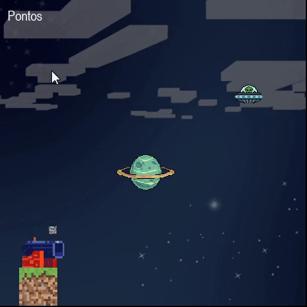

# Alien Hunt

## Descrição do Projeto

Este projeto foi desenvolvido por Rafaela Afférri para a disciplina de Álgebra Linear e Teoria da Informação, durante o 3º semestre de Ciências da Computação. O projeto foi desenvolvido no período de 1 semana com o objetivo de entender melhor vetores.

## Descrição do Jogo

O jogo, denominado Alien Hunt, tem como premissa a ideia de que o mundo de Minecraft está sendo atacado por aliens. Assim, seu objetivo como jogador é atirar nos aliens para matá-los. No entanto, existem planetas por perto que interferem na trajetória da pedra, munição do jogador, com a sua força gravitacional. O jogo contém 2 fases, para passar de cada fase, o jogador deve acertar pelo menos 5 pedras na nave espacial dos aliens.

## Como Jogar

O jogador deve usar o mouse para selecionar a direção e a velocidade em que a pedra será atirada. Quanto mais longe do canhão, maior a velocidade da pedra.



### Requisitos do Sistema

Certifique-se de ter o Python e o Pygame instalados no seu sistema.

- Pyhton 3
- Pygame

Para instalar o pygame digite o seguinte comando no seu terminal:

```
pip install pygame
```

### Instalação do Jogo
Para executar o jogo, siga estas etapas:

1. Acesse o repositório do projeto: [https://github.com/RafaelaAfferri/aps_1_alglin]

2. Faça dowload do arquivo zip do projeto. Isso pode ser feito clicando no botão escrito 'Códido' ou 'Code' , depois em 'Dowload zip'

    

3. Abra a pasta na sua IDE de preferencia e execute o arquivo Main.py


## Modelo Físico

Para poder realizar o lançamento das "pedras" no alvo do jogo, os aliens, foi necessário modelar fisicamente o Ambiente. Esse modelo foi baseado na Lei da Gravitação Universal, que possui a seguinte fórmula: $ F = \frac{{G \cdot m_1 \cdot m_2}}{{r^2}} $

Onde:
- \( F \) é a força gravitacional entre os corpos,
- \( G \) é a constante gravitacional ($ G \approx 6.674 \times 10^{-11} \, \text{m}^3 \, \text{kg}^{-1} \, \text{s}^{-2} $),
- \( m_1 \) e \( m_2 \) são as massas dos corpos envolvidos,
- \( r \) é a distância entre os centros de massa dos corpos.

A lei da Gravitação Universal diz que se dois corpos possuem massa então eles sofrem uma força atrativa, que depende de suas massas e da distancia entre eles. Essa lei física explica fenômenos como, a orbita de planetas.


No caso do jogo, a massa dos corpos e constante gravitacional foram substituídas por uma única constante fictícia que foi atribuída para cada corpo celestial do jogo.

A parte do código que modela isso é a seguinte:

``` python
distance = np.linalg.norm(celestial_body.s0 - self.s0)
gravtional_direction = (celestial_body.s0 - self.s0) / distance
gravtional_force = (celestial_body.constant / distance**2) * gravtional_direction
self.v0 = self.v0 + gravtional_force
```

No código, a variável _distance_ armazena a distância entre o corpo celestial que estamos analisando e a posição da pedra. Depois normalizamos o vetor da distância, que por sua vez a distância da atração gravitacional. Armazenamos esse resultado na variável *gravitational_direction*. Com essas informações, é possível agora calcular a força gravitacional, entre a pedra e o corpo celestial. Para isso, dividimos a constante do corpo celestial que foi citada acima pelo quadrado da distância e depois multiplicamos pela direção do vetor. Com a força gravitacional agora calculada e armazenada na variável *gravitational_force*, somamos esse valor à nossa variável _v0_, responsável por armazenar a velocidade da pedra.


